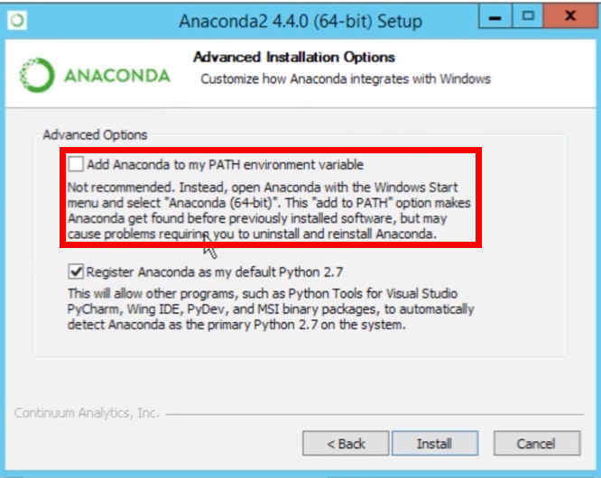

= Installation

== All Operating Systems

1. Install Java 11+, e.g. https://adoptopenjdk.net/index.html?variant=openjdk11&jvmVariant=hotspot[OpenJDK 11].
    * You can check the Java version you have installed by running `java -version` in Terminal (Linux / macOS) or Command Prompt (Windows). See https://www.baeldung.com/java-check-is-installed[How to Check if Java is Installed].
2. Install https://docs.conda.io/en/latest/miniconda.html[Miniconda] with Python version 3.x.
    * **[Windows]** During installation, enable the "Add Anaconda to my PATH environment variable" option. See https://medium.com/@GalarnykMichael/install-python-on-windows-anaconda-c63c7c3d1444[Install Python on Windows]
+

        
    * You can check the Conda version you have installed by running `conda --version` in Terminal (Linux / macOS) or Command Prompt (Windows). See https://docs.conda.io/projects/conda/en/latest/user-guide/getting-started.html#managing-conda[Managing conda].

== Linux

1. Run the included `install.sh` script. See https://www.computerhope.com/issues/ch001648.htm[How to run .sh in Linux].
    * Open a Terminal window (Ctrl+Alt+T).
    * Run `cd <install-directory>`, replacing *<install-directory>* with the complete path to the installation directory.
    * Run `chmod +x ./install.sh`.
    * Run `./install.sh`.
2. Start JupyterLab
    * Run `cd <notebook-directory>`, replacing *<notebook-directory>* with the complete path to the root directory for your notebooks.
    * Run `jupyter lab`.
    * JupyterLab will start in a browser window.

== macOS

1. Run the included `install.sh` script. 
    * Open a Terminal window. See https://www.wikihow.com/Open-a-Terminal-Window-in-Mac[How to Open a Terminal Window in Mac].
    * Run `cd <install-directory>`, replacing *<install-directory>* with the complete path to the installation directory.
    * Run `chmod +x ./install.sh`. See https://support.apple.com/guide/terminal/make-a-file-executable-apdd100908f-06b3-4e63-8a87-32e71241bab4/mac[Make a file executable in Terminal on Mac].
    * Run `./install.sh`.
2. Start JupyterLab
    * Run `cd <notebook-directory>`, replacing *<notebook-directory>* with the complete path to the root directory for your notebooks.
    * Run `jupyter lab`.
    * JupyterLab will start in a browser window.

== Windows
1. Run the included `install.bat` script.
    * Double click `install.bat` from File Explorer. See https://www.windowscentral.com/how-create-and-run-batch-file-windows-10#run_batch_file_windows10[How to run a batch file on Windows 10].
    * Alternatively use Run or Command Prompt. See https://www.wikihow.com/Run-a-Batch-File-from-the-Command-Line-on-Windows[How to Run a Batch File from the Command Line on Windows].
2. Start JupyterLab
    * Open Command Prompt.
    * Run `cd <notebook-directory>`, replacing *<notebook-directory>* with the complete path to the root directory for your notebooks.
    * Run `jupyter lab`.
    * JupyterLab will start in a browser window.
    